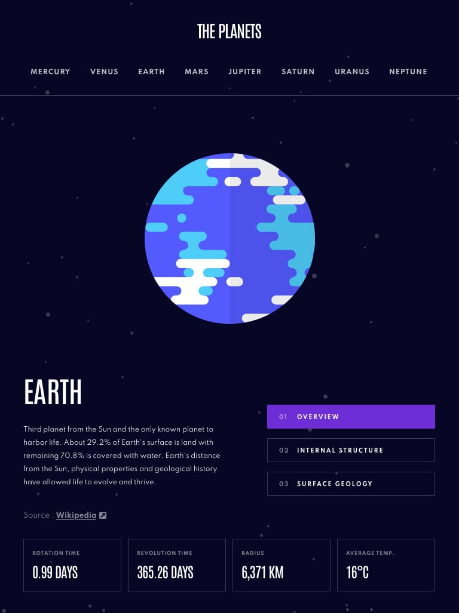

# planets-fact-site

## Roadmap

- [Overview](#overview)

  - [The challenge](#the-challenge)
  - [Screenshot](#designs)
  - [Links](#links)

- [My process](#my-process)
  - [Built with](#built-with)
  - [What I learned](#what-i-learned)
- [Author](#author)

## Overview

### The challenge

## Users Can

Explore detailed information about each planet on the Planets Fact Site. The user interface is designed with the following features:

- **Overview:** Click on the "Overview" button to access a comprehensive overview planet.
- **Internal Structure:** Navigate to the "Internal Structure" section to learn about the composition and layers beneath the surface planet.

- **Surface Geology:** Discover the unique surface features planet by selecting the "Surface Geology" button.

At the bottom of the page, find key planetary statistics:

- **Rotation Time:** View the time it takes for each planet to complete one rotation.
- **Revolution Time:** Explore the duration of each planet's orbit around the sun.

- **Radius:** Understand the size of each planet by examining its radius.

- **Average Temperature:** Get insights into the average temperatures on each planet.

### Designs

### Links

- Solution URL: [GitHub Code](https://github.com/AchiPhutkaradze/planets-fact-site)
- Live Site URL: [Live](https://planets-fact-site-xi.vercel.app)

## My process

### Built with

- React.js with TypeScript
- React-Router
- Data.json Integration
- styled-components
- CSS Grid and Flexbox
- Mobile-first workflow

### What I learned

I used React Router for the first time and learned how to work with it also improved my knowledge in Typescript, React and working with data

## author

- Linkedin - [Tamazi Phutkaradze](https://www.linkedin.com/in/tamazi-phutkaradze-a629b7265/)
